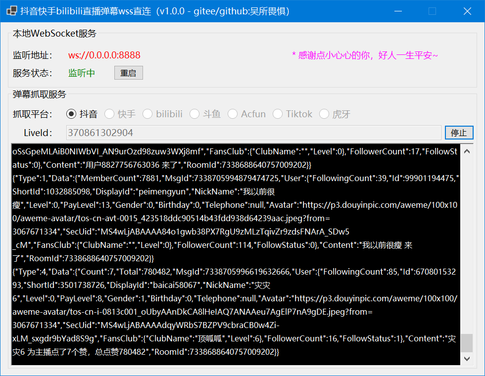
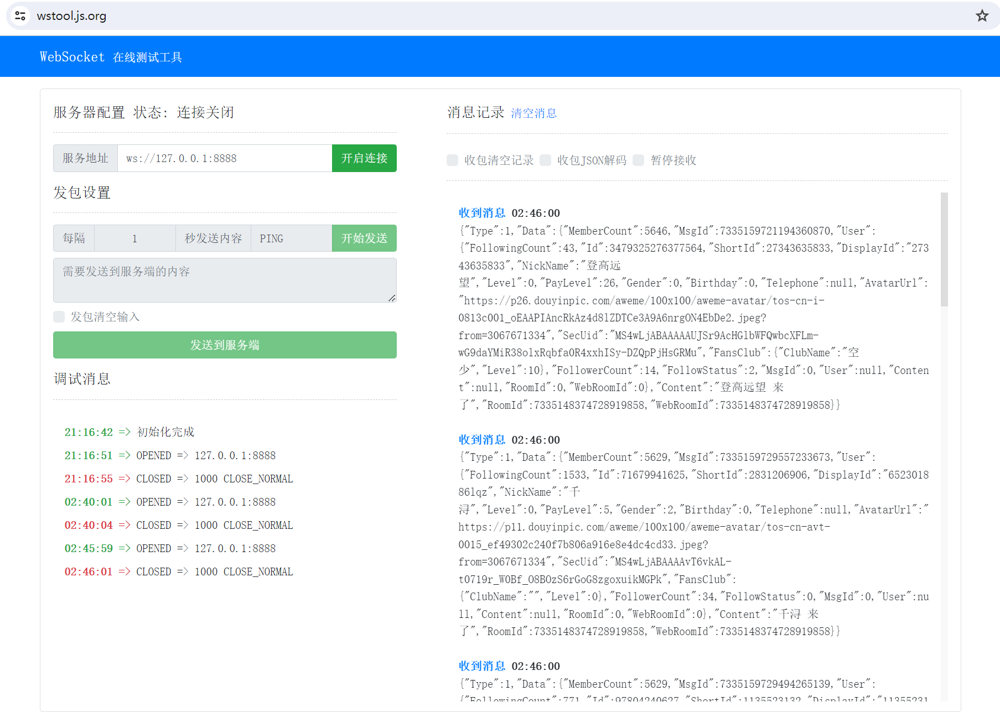

# 抖音快手bilibili直播弹幕wss直连

## 项目介绍

抖音/快手/bilibibli/斗鱼/Acfun/虎牙/YY/战旗/花椒等直播间弹幕，wss直连，非系统代理方式，无需多开浏览器窗口，且获取到弹幕数据后自定义转发。

**（2024年2月29日12:42，本程序测试：正常）**

2024-02-23，完成抖音弹幕监听功能，接下来开发快手的，敬请期待~

## 支持平台

* [X] 抖音
* [ ] 快手
* [ ] bilibili
* [ ] 斗鱼
* [ ] Acfun
* [ ] 虎牙

## 效果图



## 软件架构

### **1.开发&运行环境**

1).基于.NET 8.0开发，最低支持Win7 SP1系统运行（更多.NET版本与Windows系统支持关系，请查看：[https://www.newlifex.com/tech/os_net](https://www.newlifex.com/tech/os_net)）。

2).MacOS暂不支持，后面会用MAUI做适配处理

### **2.使用技术(nuget包)**

1).传输协议：**Google.Protobuf**，传送门：[https://github.com/protocolbuffers/protobuf](https://github.com/protocolbuffers/protobuf)

2).WebSocket服务器：**Fleck**，传送门：[https://github.com/statianzo/Fleck](https://github.com/statianzo/Fleck)

3).WebSocket客户端：**System.Net.WebSockets**，传送门：[https://learn.microsoft.com/zh-cn/dotnet/api/system.net.websockets.websocket?view=net-8.0](https://learn.microsoft.com/zh-cn/dotnet/api/system.net.websockets.websocket?view=net-8.0)

4).Rest请求：**RestSharp**，传送门：[https://restsharp.dev](https://restsharp.dev)

5).Json序列/反序列化：**Newtonsoft.Json**，传送门：[https://www.newtonsoft.com/json](https://www.newtonsoft.com/json)

## 使用说明

1. 安装.NET 8.0运行环境，官方下载地址：[https://dotnet.microsoft.com/zh-cn/download/dotnet/latest](https://dotnet.microsoft.com/zh-cn/download/dotnet/latest)
2. 安装VisualStudio 2022，并升级到 **17.8+** 版本：
   
3. 用WebSocket客户端，连接到 `ws://127.0.0.1:8888`，您也可以试用在线连接工具：[https://wstool.js.org](https://wstool.js.org)，效果如图所示：

   

## 消息体注解

### 一、抖音

#### 1.进入房间

```json
{
	"Type": 1,
	"Data": {
		"MemberCount": 6438,
		"MsgId": 7338701468109681418,
		"User": {
			"FollowingCount": 269,
			"Id": 101685213389,
			"ShortId": 1196943920,
			"DisplayId": "1196943920",
			"NickName": "小铭.",
			"Level": 0,
			"PayLevel": 0,
			"Gender": 1,
			"Birthday": 0,
			"Telephone": null,
			//如果头像需要更大的图片，可以将url中的100x100，替换为200x200
			"Avatar": "https://p26.douyinpic.com/aweme/100x100/aweme-avatar/tos-cn-i-0813c001_oIxcMIzDAm9MAQkIKCelAmCngoCeAA5ZbkTAaI.jpeg?from=3067671334",
			"SecUid": "MS4wLjABAAAA0MIs0Ia9g0qJgNLjbb6Ui21F7-kN6linqTJ0SlrxbpE",
			"FansClub": {
				"ClubName": "",
				"Level": 0
			},
			"FollowerCount": 23,
			"FollowStatus": 1
		},
		"Content": "小铭. 来了",
		"RoomId": 7338688640757009202
	}
}
```

#### 2.关注

```json
{
	"Type": 2,
	"Data": {
		"MsgId": 7338701469288500020,
		"User": {
			"FollowingCount": 217,
			"Id": 70182119246,
			"ShortId": 4125395366,
			"DisplayId": "dyi9z7nn8swe",
			"NickName": "♥",
			"Level": 0,
			"PayLevel": 0,
			"Gender": 0,
			"Birthday": 0,
			"Telephone": null,
			"Avatar": "https://p11.douyinpic.com/aweme/100x100/aweme-avatar/tos-cn-i-0813_892bdf2e00db4753991ecb8348ef25c5.jpeg?from=3067671334",
			"SecUid": "MS4wLjABAAAA3XBoQKvXh1VIONd6G4edMhwXt2o_bsJQsL-j1g4nN5E",
			"FansClub": {
				"ClubName": "",
				"Level": 0
			},
			"FollowerCount": 9,
			"FollowStatus": 1
		},
		"Content": "♥ 关注了主播",
		"RoomId": 7338688640757009202
	}
}
```

#### 3.弹幕

```json
{
	"Type": 3,
	"Data": {
		"MsgId": 7338697347818230818,
		"User": {
			"FollowingCount": 134,
			"Id": 1411400097607259,
			"ShortId": 2200868407,
			"DisplayId": "2200868407",
			"NickName": "雅馨💅",
			"Level": 0,
			"PayLevel": 30,
			"Gender": 2,
			"Birthday": 0,
			"Telephone": null,
			"Avatar": "https://p3.douyinpic.com/aweme/100x100/aweme-avatar/tos-cn-i-0813c001_oUHIAzME2AfjA31NAgFUpNymZDeA6AayhIsCAo.jpeg?from=3067671334",
			"SecUid": "MS4wLjABAAAAxKx07UstZBmcpNz4vr4r8pRbq5PYRcP98mI--SQx0c7fHVa7pmMCYFdvnlgmivty",
			"FansClub": {
				"ClubName": "熊家人",
				"Level": 8
			},
			"FollowerCount": 325,
			"FollowStatus": 2
		},
		"Content": "流量呢",
		"RoomId": 7338657973104921378
	}
}
```

#### 4.点赞

```json
{
	"Type": 4,
	"Data": {
		"Count": 5,
		"Total": 418060,
		"MsgId": 7338697335486453772,
		"User": {
			"FollowingCount": 2885,
			"Id": 101385281892,
			"ShortId": 1173935310,
			"DisplayId": "1173935310",
			"NickName": "种花的不买张刀（杨清）",
			"Level": 0,
			"PayLevel": 19,
			"Gender": 0,
			"Birthday": 0,
			"Telephone": null,
			"Avatar": "https://p3.douyinpic.com/aweme/100x100/aweme-avatar/mosaic-legacy_1c9f300069de5b1a41303.jpeg?from=3067671334",
			"SecUid": "MS4wLjABAAAA2QEhMnB1rX4ePA7iQ9SQ1805lEcxeBQOQ5SBAysazAU",
			"FansClub": {
				"ClubName": "熊家人",
				"Level": 13
			},
			"FollowerCount": 277,
			"FollowStatus": 1
		},
		"Content": "种花的不买张刀（杨清） 为主播点了5个赞，总点赞418060",
		"RoomId": 7338657973104921378
	}
}
```

#### 5.礼物

```json
{
	"Type": 5,
	"Data": {
		"GiftId": 2002,
		"GiftName": "大啤酒",
		"GroupId": 0,
		"GiftCount": 1,
		"RepeatCount": 0,
		"DiamondCount": 2,
		"ToUser": null,
		"MsgId": 7338697242632999936,
		"User": {
			"FollowingCount": 5828,
			"Id": 75473804556,
			"ShortId": 122703863,
			"DisplayId": "122703863",
			"NickName": "温馨❤️的港湾💤",
			"Level": 1,
			"PayLevel": 32,
			"Gender": 2,
			"Birthday": 0,
			"Telephone": null,
			"Avatar": "https://p11.douyinpic.com/aweme/100x100/aweme-avatar/tos-cn-i-0813_e683277c719241259afb241932527869.jpeg?from=3067671334",
			"SecUid": "MS4wLjABAAAAyBD6W4wd1UfvQQahxuhX8fOZxtH2TxdjHzH6y1-xyJw",
			"FansClub": {
				"ClubName": "熊家人",
				"Level": 3
			},
			"FollowerCount": 511,
			"FollowStatus": 0
		},
		"Content": "温馨❤️的港湾💤 送出 大啤酒 x 1 个",
		"RoomId": 7338657973104921378
	}
}
```

#### 6.分享

(略)

#### 7.统计

```json
{
	"Type": 7,
	"Data": {
		"OnlineUserCount": 3937,
		"TotalUserCount": 269277,
		"TotalUserCountStr": "26.9万",
		"OnlineUserCountStr": "3937",
		"MsgId": 7338699901570204223,
		"User": null,
		"Content": "当前直播间人数 3937，累计直播间人数 26.9万",
		"RoomId": 7338657973104921378
	}
}
```

#### 8.直播间状态变更

```json
{
	"Type": 8,
	"Data": {
		"MsgId": 7338700002526595855,
		"User": null,
		"Content": "直播已结束",
		"RoomId": 7338657973104921378
	}
}
```

#### 9.粉丝团

```json
{
	"Type": 9,
	"Data": {
		"Type": 2,
		"Level": 1,
		"MsgId": 7338703879909034779,
		"User": {
			"FollowingCount": 19,
			"Id": 770085205058926,
			"ShortId": 42194476251,
			"DisplayId": "42194476251",
			"NickName": "出生玩安琪拉花木兰",
			"Level": 0,
			"PayLevel": 8,
			"Gender": 0,
			"Birthday": 0,
			"Telephone": null,
			"Avatar": "https://p26.douyinpic.com/aweme/100x100/aweme-avatar/tos-cn-avt-0015_5b72dfa27936366907d942cd5dbb62e3.jpeg?from=3067671334",
			"SecUid": "MS4wLjABAAAAzHDOEn6mMGfto0moTJcFr3GkwaePeCKE1tigww0PDO0",
			"FansClub": {
				"ClubName": "顶呱呱",
				"Level": 1
			},
			"FollowerCount": 1,
			"FollowStatus": 0
		},
		"Content": "恭喜 出生玩安琪拉花木兰 成为粉丝团第165725名成员",
		"RoomId": 7338688640757009202
	}
}
```

## 声明

1. 要用本项目的，强烈期盼给作者比个小心心，谢谢，你们的star是我的动力！
2. 本开源代码，灵感源自于原github上的python项目实现：[https://github.com/saermart/DouyinLiveWebFetcher](https://github.com/saermart/DouyinLiveWebFetcher)
3. 本人只是用C#重构一遍已经存在的技术和方案，为了方便在windows和macos上直接窗体运行，所以你们要拿去干嘛，与本人无关！
4. 本人郑重声明：本代码库所有代码均只用于学习研究交流，严禁用于包括但不限于商业谋利、破坏系统、盗取个人信息等不良不法行为！
5. 本人强烈谴责：违反本人声明，及使用所产生的一切后果均由违反声明使用者承担！
6. 侵权或涉及相关利益请联系我，微信：**xhhdqq**
7. 

## 关于本人

1. 10年C#开发
2. 7年Java开发
3. 5年前端开发
4. 十来年各大政府、企业等相关工作、交流经验
5. 现在在搞python和和人工智能
6. 爱好搞程序，什么项目都能做，所以，做项目找我，给你解决方案！！！

## 后续

1. 本人在做一款直播盒子，辅助直播用的，实现半/全无人直播，包含：视频实时换脸，音频实时换色，手机远程控制开播情况，直播特效、直播游戏等，敬请期待！
2. 诚邀会推广的朋友，会做小游戏的朋友（不管web还是pc端），接入我的直播盒子，统一授权，统一接入弹幕，我们一起把生态做起来。
3. 如果你不会技术，搞直播也行，欢迎

## 交流

1. 本仓库代码完全开源
2. 欢迎小伙伴一起维护本仓库
3. 有业务问题，添加本人微信：**xhhdqq**
4. 有技术问题，以及技术交流，可加入QQ群聊：**171358793**

   

   The End.

## 代码版本

* 2024.02.23：v1.0.0

  > 1.完成：[抖音]直播间消息规范；
  >

  > 2.修改：架构优化；
  >
* 2024.02.14：v0.6.0

  > 1.添加：规范[抖音]进入直播间消息数据格式；
  >

  > 2.修改：架构调整，优化代码；
  >
* 2024.02.06：v0.5.0

  > 1.添加：抖音弹幕抓取服务，wss直连；
  >

  > 2.添加：本地WebSocket服务，监听任意IP，8888端口；
  >
