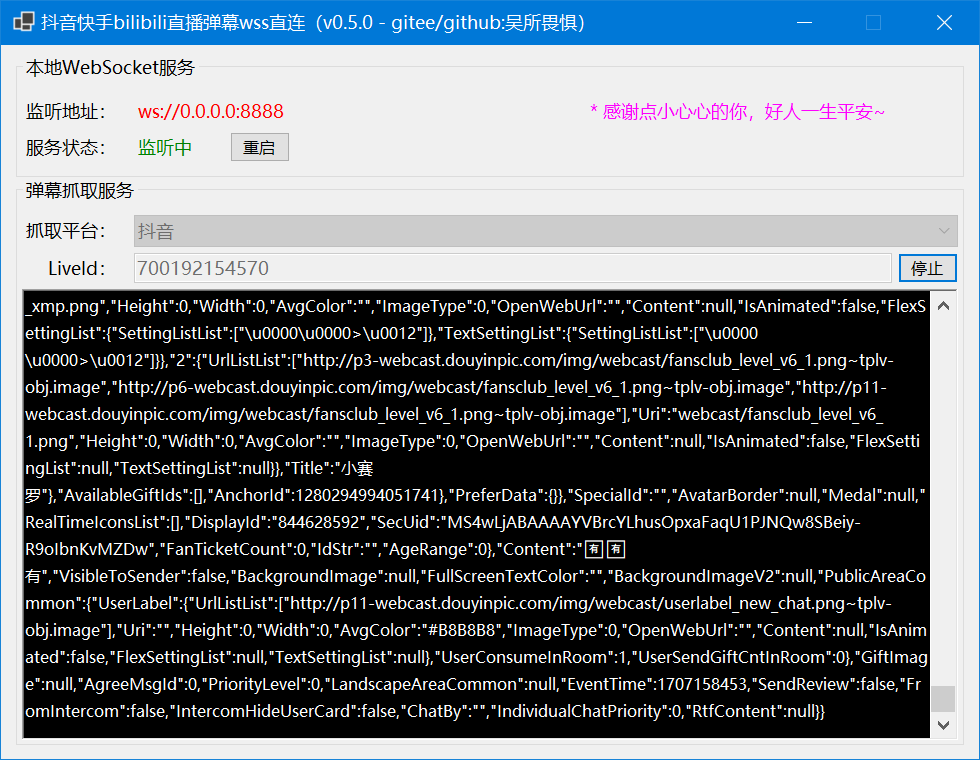
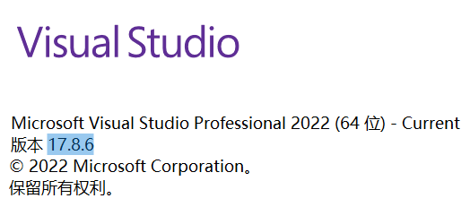
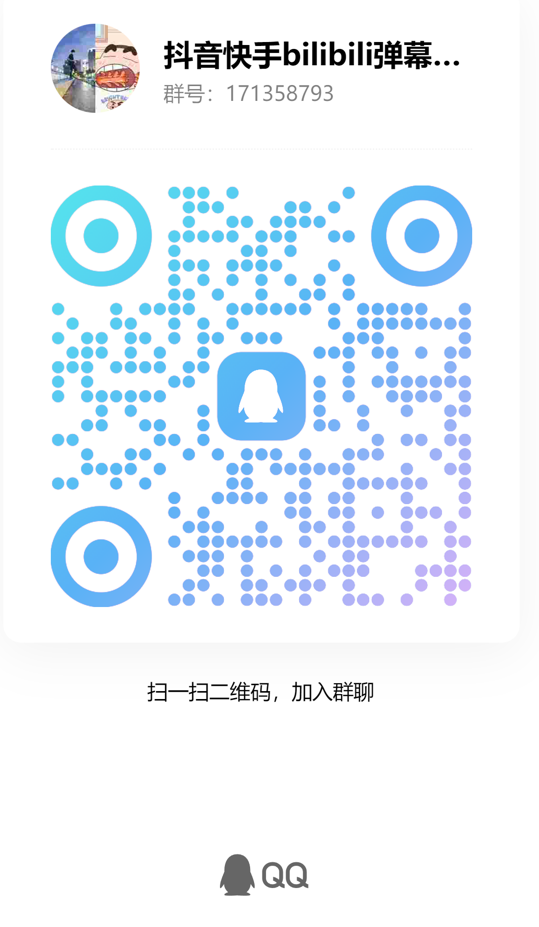

# 抖音快手bilibili直播弹幕wss直连

## 项目介绍

抖音/快手/bilibibli/斗鱼/Acfun/虎牙/YY/战旗/花椒等直播间弹幕，wss直连，非系统代理方式，无需多开浏览器窗口，且获取到弹幕数据后自定义转发。

（2024年2月6日，本程序测试：正常）

## 支持平台

* [X] 抖音
* [ ] 快手
* [ ] bilibili
* [ ] 斗鱼
* [ ] Acfun
* [ ] 虎牙

## 效果图

## 软件架构

### **1.开发&运行环境**

1).基于.NET 8.0开发，最低支持Win7 SP1系统运行（更多.NET版本与Windows系统支持关系，请查看：[https://www.newlifex.com/tech/os_net](https://www.newlifex.com/tech/os_net)）。

2).MacOS暂不支持，后面会用MAUI做适配处理

### **2.使用技术(nuget包)**

1).传输协议：**Google.Protobuf**，传送门：[https://github.com/protocolbuffers/protobuf](https://github.com/protocolbuffers/protobuf)

2).WebSocket服务器：**Fleck，**传送门**：**[https://github.com/statianzo/Fleck](https://github.com/statianzo/Fleck)

3).WebSocket客户端：**System.Net.WebSockets**，传送门：[https://learn.microsoft.com/zh-cn/dotnet/api/system.net.websockets.websocket?view=net-8.0](https://learn.microsoft.com/zh-cn/dotnet/api/system.net.websockets.websocket?view=net-8.0)

4).Rest请求：**RestSharp**，传送门：[https://restsharp.dev](https://restsharp.dev)

## 使用说明（如果只是运行，完成第1步即可；如果要开发，需要完成第2步。）

1. 安装.NET 8.0运行环境，官方下载地址：[https://dotnet.microsoft.com/zh-cn/download/dotnet/latest](https://dotnet.microsoft.com/zh-cn/download/dotnet/latest)
2. 安装VisualStudio 2022，并升级到 **17.8+** 版本：
   

## 声明

1. 要用本项目的，强烈期盼给作者比个小心心，谢谢，你们的star是我的动力！
2. 本开源代码，灵感源自于原github上的python项目实现：[https://github.com/saermart/DouyinLiveWebFetcher](https://github.com/saermart/DouyinLiveWebFetcher)
3. 本人只是用C#重构一遍已经存在的技术和方案，为了方便在windows和macos上直接窗体运行，所以你们要拿去干嘛，与本人无关！
4. 本人郑重声明：本代码库所有代码均只用于学习研究交流，严禁用于包括但不限于商业谋利、破坏系统、盗取个人信息等不良不法行为！
5. 本人强烈谴责：违反本人声明，及使用所产生的一切后果均由违反声明使用者承担！
6. 侵权或涉及相关利益请联系我，微信：**xhhdqq**
   

## 关于本人

1. 10年C#开发
2. 7年Java开发
3. 5年前端开发
4. 十来年各大政府、企业等相关工作、交流经验
5. 现在在搞python和和人工智能
6. 爱好搞程序，什么项目都能做，所以，做项目找我，给你解决方案！！！

## 后续

1. 本人在做一款直播盒子，辅助直播用的，实现半/全无人直播，包含：视频实时换脸，音频实时换色，手机远程控制开播情况，直播特效、直播游戏等，敬请期待！
2. 诚邀会推广的朋友，会做小游戏的朋友（不管web还是pc端），接入我的直播盒子，统一授权，统一接入弹幕，我们一起把生态做起来。
3. 如果你不会技术，搞直播也行，欢迎

## 交流

1. 本仓库代码完全开源
2. 欢迎小伙伴一起维护本仓库
3. 有业务问题，添加本人微信：**xhhdqq**
4. 有技术问题，以及技术交流，可加入QQ群聊：**171358793**

   

   The End.
